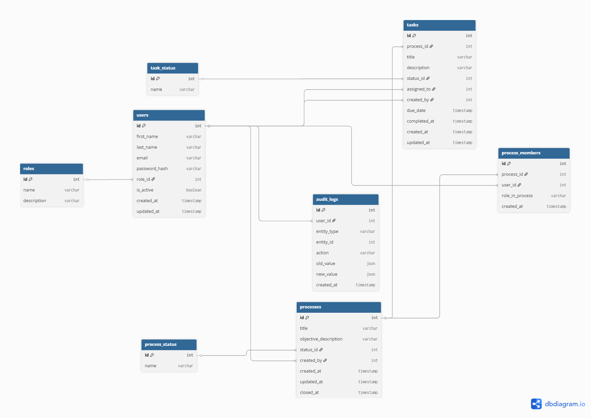

# Database Design

The system is built on a relational database
designed to support task and process management.

## Core Entities

Users
Processes
Tasks
ProcessMembers
AuditLogs
Roles

## Relationships

- A user can belong to many processes
- A process contains multiple tasks
- Tasks are assigned to users

## Database Diagram

## Editable Diagram

Interactive version of the schema:

https://dbdiagram.io/d/69ac3067a3f0aa31e12491ca

